# Springboot and RabbitMq via Docker

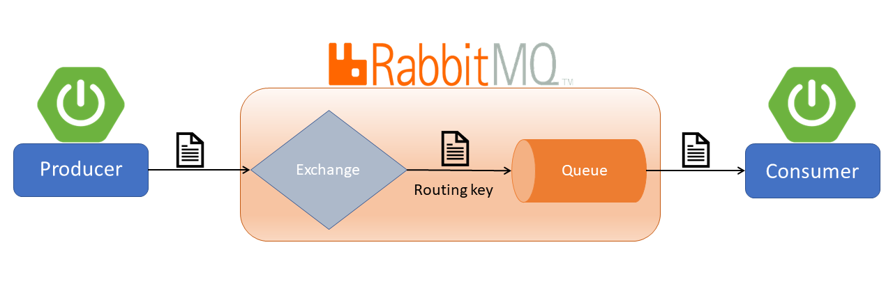

## Information

 - it is a structure of **message-queueing**
 - **RabbitMQ** just transfers data which is coming from Producer to its subcriber which is called as Consumer by turns
 - Here is the explanation of the project
    - In **Producer** part, the project sends a message containg text or POJO to **Rabbit Server**
    - As **Producer** has no idea about queue , the **message** is transmitted to the **queue** over the exchange according to the **queue routing key**
    - Then **Consumer** part listens the **queue** which works with FIFO logic and **consume** the message. After that, it completes the process
## Run the App
1) Install **Docker Desktop**. Here is the installation link : https://docs.docker.com/docker-for-windows/install/
2) Open Terminal under resources folder to run RabbitMq on **Docker Container**
```bash
  docker-compose up -d
```
3) Show **Container** which runs on **Docker**
```bash
  docker ps
```
4) Open **RabbitMq** in localhost
```bash
  http://localhost:15672/
```
5) Enter username and password which are defined in **application.properties file**
```bash
  spring.rabbitmq.username=rabbitMq
  spring.rabbitmq.password=123
```
6) Open **Postman** and define body before implementing post request to defined url
```bash
      http://localhost:8080/order/NyalaHotel

    {
        "name" : "caprieto",
        "qty" : 2,
        "price" : 300
    }

```
7) After submission, click **connection** in the navigation bar to trace packets and then click **queue** to determine if it is empty
## Screenshots
<details>
<summary>Click here to show the screenshots of project</summary>
 <br>
 <p> DockerCLI </p>
 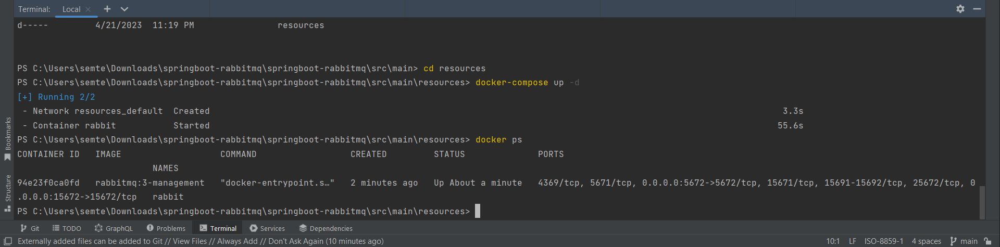
 <p> Docker </p>
 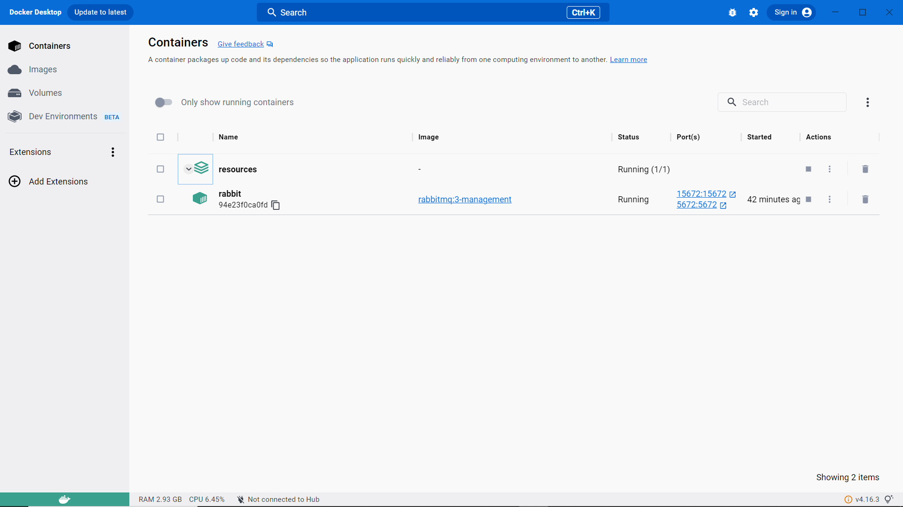
 <p> Postman </p>
 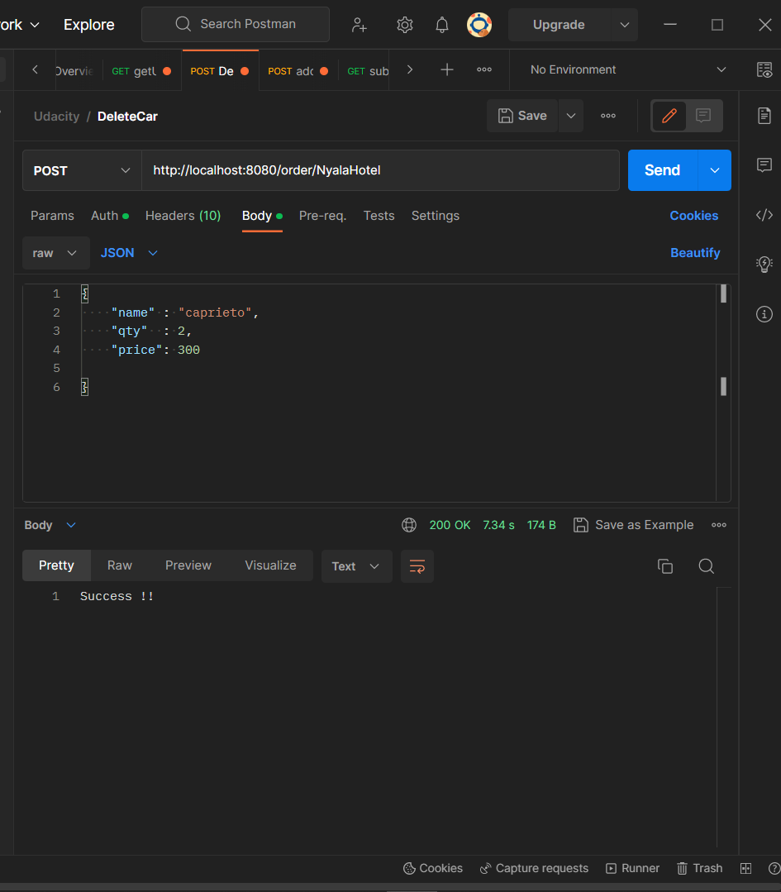
  <p> RabbitMq </p>
 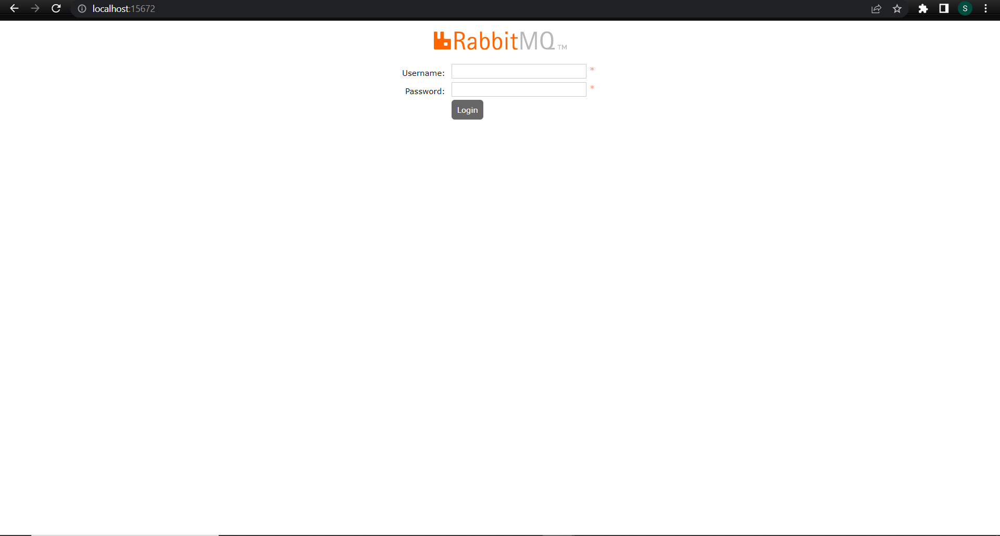
  <p> RabbitMq </p>
 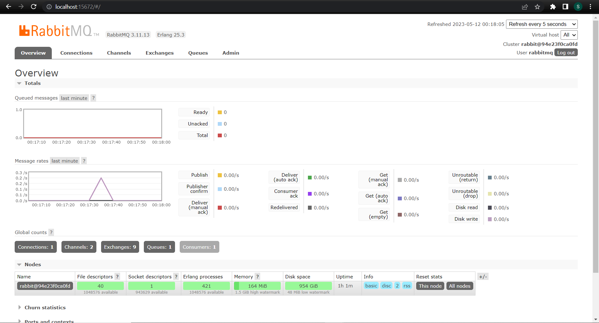
  <p> RabbitMq </p>
 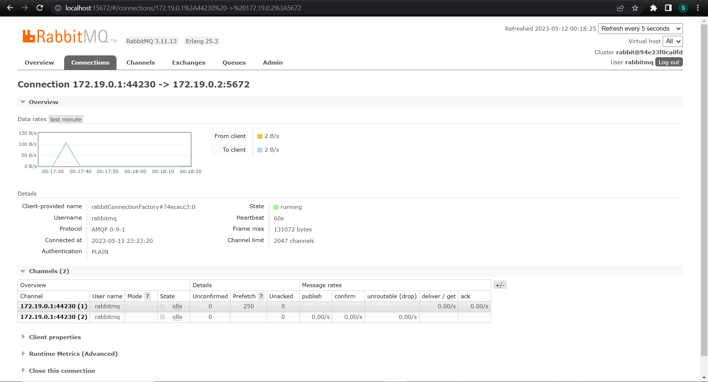
  <p> RabbitMq </p>
 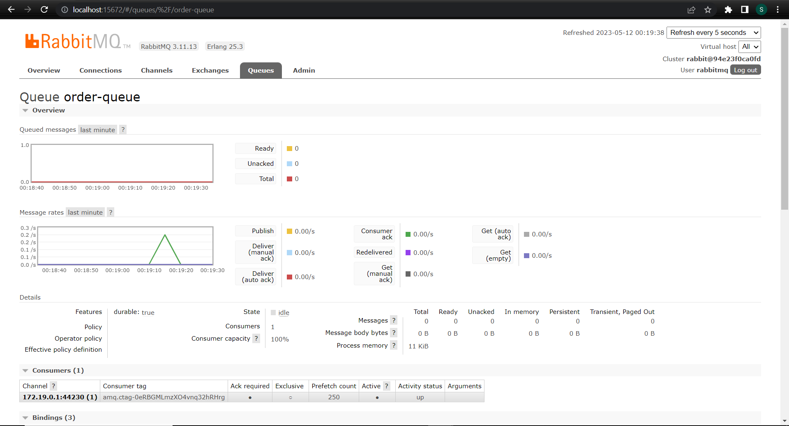
  <p> Springboot </p>
 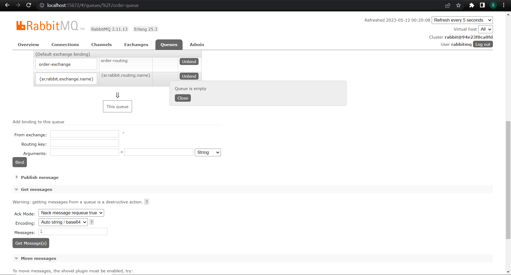
  <p> Springboot </p>
 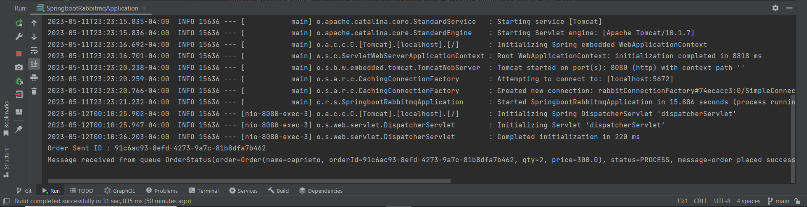
  <p> Springboot </p>
 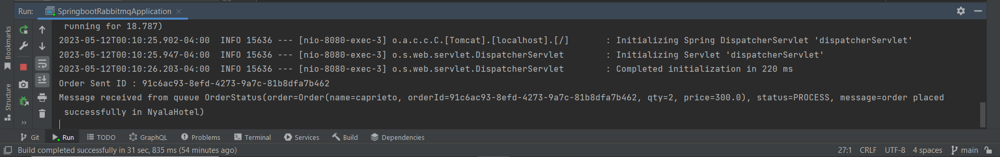
</details>

